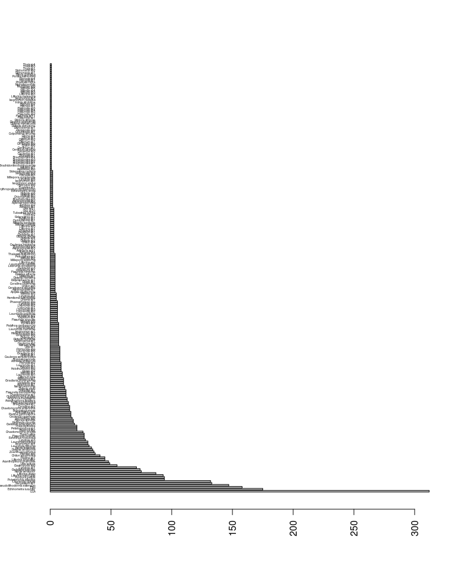
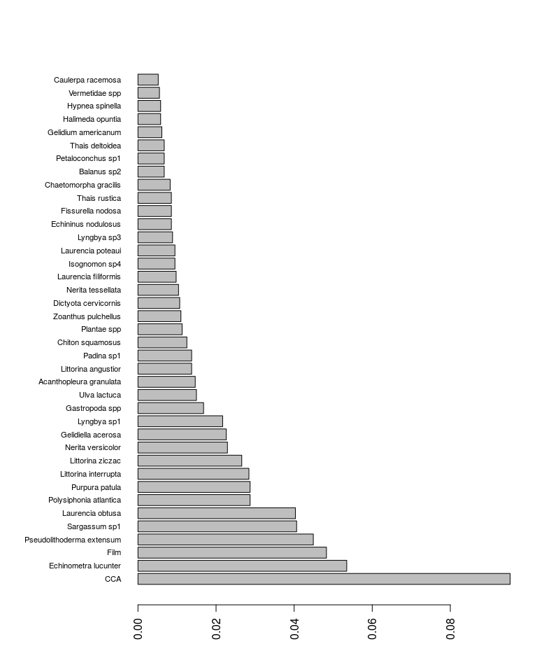

Extract Taxa list from SARCE country data
================

-   [Introduction](#introduction)
-   [Read the data](#read-the-data)
-   [Clean the data](#clean-the-data)
-   [Extract the taxa list](#extract-the-taxa-list)
-   [Frequency of Taxa](#frequency-of-taxa)

Introduction
------------

This script will read SARCE data and extract the list of taxa. The extracted list will be matched against WoRMS and the corrections made. The SARCE dataset is already split by country.

Read the data
-------------

The SARCE dataset in full is a table in wide format, with the taxon name in the columns along with many other variables identifying the site. If the taxon is present is marked with "1" otherwise is "NA". We will produce a table in long format with the taxon name in the column "scientificName" (standard DwC name). As this table is only presence/absence we will recode that in the "occurrence" variable.

``` r
library(tidyr)
library(readr)  ## this one is better for reading the wide-table

## I'll use Venezuela as case study here
## read the data
SARCE <- read_csv("data/SARCE/Venezuela.csv")
```

    ## Parsed with column specification:
    ## cols(
    ##   .default = col_character(),
    ##   Abiota = col_integer(),
    ##   Acanthophora_spicifera = col_integer(),
    ##   Acanthopleura_granulata = col_integer(),
    ##   Acmaea_antillarum = col_integer(),
    ##   Acmaea_sp1 = col_integer(),
    ##   Acmaea_sp2 = col_integer(),
    ##   Acmaea_sp4 = col_integer(),
    ##   Actiniaria_spp1 = col_integer(),
    ##   Agaricia_agaricites = col_integer(),
    ##   Amphiroa_fragilissima = col_integer(),
    ##   Amphiroa_sp1 = col_integer(),
    ##   Aplysia_dactylomela = col_integer(),
    ##   Ascidiidae_spp = col_integer(),
    ##   Asparagopsis_sp1 = col_integer(),
    ##   Asparagopsis_sp2 = col_integer(),
    ##   Asparagopsis_sp3 = col_integer(),
    ##   Astraea_sp1 = col_integer(),
    ##   Astraea_tecta = col_integer(),
    ##   Balanus_sp2 = col_integer(),
    ##   Bivalvia_spp = col_integer()
    ##   # ... with 203 more columns
    ## )

    ## See spec(...) for full column specifications.

``` r
## see the tablel dimensions
dim(SARCE)
```

    ## [1]  620 1136

Clean the data
--------------

You see that the SARCEezuela SARCE table has 620 rows and 1136 columns.

**TIP**: in RStudio, if you have a very wide table (i.e. many columns) don't try to view the table in the viewer as it will take very long time to accommodate all the columns in the memory

Now, let extract the names of the taxa in the table. In the SARCE table, the first two columns are identification values, then the taxon name are in columns 3:1113. The rest of the columns are variables associated with the site (lat, lon, depth, zone, etc). More on those columns later...

So lets use `tidyr::gather` to convert the table from wide to long format

``` r
SARCE.long = gather(SARCE, key=scientificName, value=occurrence, 3:1113)

## look at the structure
str(SARCE.long)
```

    ## Classes 'tbl_df', 'tbl' and 'data.frame':    688820 obs. of  27 variables:
    ##  $ Id            : chr  "Ve-Mi-Chi-Cor-L1" "Ve-Mi-Chi-Cor-L2" "Ve-Mi-Chi-Cor-L3" "Ve-Mi-Chi-Cor-L4" ...
    ##  $ pathString    : chr  "Ve/Mi/Chi/Cor/L1" "Ve/Mi/Chi/Cor/L2" "Ve/Mi/Chi/Cor/L3" "Ve/Mi/Chi/Cor/L4" ...
    ##  $ Year          : int  2010 2010 2010 2010 2010 2010 2010 2010 2010 2010 ...
    ##  $ Months        : int  7 7 7 7 7 7 7 7 7 7 ...
    ##  $ Country       : chr  "Venezuela" "Venezuela" "Venezuela" "Venezuela" ...
    ##  $ Country_code  : chr  "Ve" "Ve" "Ve" "Ve" ...
    ##  $ State         : chr  "Miranda" "Miranda" "Miranda" "Miranda" ...
    ##  $ State_code    : chr  "Mi" "Mi" "Mi" "Mi" ...
    ##  $ Locality      : chr  "Chirimena" "Chirimena" "Chirimena" "Chirimena" ...
    ##  $ Locality_code : chr  "Chi" "Chi" "Chi" "Chi" ...
    ##  $ Site          : chr  "Corrales" "Corrales" "Corrales" "Corrales" ...
    ##  $ Site_code     : chr  "Cor" "Cor" "Cor" "Cor" ...
    ##  $ Strata        : chr  "Lowtide" "Lowtide" "Lowtide" "Lowtide" ...
    ##  $ Strata_code   : chr  "L" "L" "L" "L" ...
    ##  $ Sampling Date : chr  "07/30/14" "07/30/14" "07/30/14" "07/30/14" ...
    ##  $ Observers     : chr  "JJ_Cruz/C_Herrera/A_Hernandez/N_Fernandez" "JJ_Cruz/C_Herrera/A_Hernandez/N_Fernandez" "JJ_Cruz/C_Herrera/A_Hernandez/N_Fernandez" "JJ_Cruz/C_Herrera/A_Hernandez/N_Fernandez" ...
    ##  $ Picture number: chr  "IMG_3308" "IMG_3309" "IMG_3310" "IMG_3311" ...
    ##  $ Replicate     : int  1 2 3 4 5 6 7 8 9 10 ...
    ##  $ Labelscopy    : chr  "Ve-Mi-Chi-Cor-L1" "Ve-Mi-Chi-Cor-L2" "Ve-Mi-Chi-Cor-L3" "Ve-Mi-Chi-Cor-L4" ...
    ##  $ Si-Strata     : chr  "Cor-Lowtide" "Cor-Lowtide" "Cor-Lowtide" "Cor-Lowtide" ...
    ##  $ BioR          : int  66 66 66 66 66 66 66 66 66 66 ...
    ##  $ Latitude      : num  10.6 10.6 10.6 10.6 10.6 ...
    ##  $ Bioregion     : chr  "South_caribbean" "South_caribbean" "South_caribbean" "South_caribbean" ...
    ##  $ Ocean         : chr  "Atlantic" "Atlantic" "Atlantic" "Atlantic" ...
    ##  $ Zone          : chr  "Tropics" "Tropics" "Tropics" "Tropics" ...
    ##  $ scientificName: chr  "Abiota" "Abiota" "Abiota" "Abiota" ...
    ##  $ occurrence    : chr  NA NA NA NA ...

We need to do some cleaning. The taxon name is separated by an underscore. we want a space (for WoRMS to process the match). We don't need lines with `occurrence` equal to NA (that means that this particular taxon was not observed) nor the taxon "Abiotic"

``` r
## remote the lines with occurrence == NA
SARCE.long = SARCE.long %>% drop_na(occurrence)

## this could also be done with standard R command is.na
## SARCE.long = SARCE.long[!is.na(SARCE.long$occurrence),]

## remote the lines with taxa "abiotic"
SARCE.long = SARCE.long[SARCE.long$scientificName!="Abiota",]

## replace the underscore in the taxon name by a space
SARCE.long$scientificName = gsub("_", " ", SARCE.long$scientificName)
```

Extract the taxa list
---------------------

Now with the date clean, let extract the taxon list, and save it in a text file for matching with WoRMS

``` r
taxa = unique(SARCE.long$scientificName)
print(taxa)
```

    ##   [1] "Acanthophora spicifera"    "Acanthopleura granulata"  
    ##   [3] "Acmaea antillarum"         "Acmaea sp1"               
    ##   [5] "Acmaea sp2"                "Acmaea sp4"               
    ##   [7] "Actiniaria spp1"           "Agaricia agaricites"      
    ##   [9] "Amphiroa fragilissima"     "Amphiroa sp1"             
    ##  [11] "Aplysia dactylomela"       "Ascidiidae spp"           
    ##  [13] "Asparagopsis sp1"          "Asparagopsis sp2"         
    ##  [15] "Asparagopsis sp3"          "Astraea sp1"              
    ##  [17] "Astraea tecta"             "Balanus sp2"              
    ##  [19] "Bivalvia spp"              "Brachidontes dominguensis"
    ##  [21] "Brachidontes sp1"          "Brachidontes sp2"         
    ##  [23] "Brachidontes sp3"          "Brachidontes sp4"         
    ##  [25] "Brachidontes sp5"          "Brachidontes sp6"         
    ##  [27] "Brachidontes sp7"          "Bryopsis pennata"         
    ##  [29] "Bryopsis plumosa"          "Bryopsis sp1"             
    ##  [31] "Caulerpa mexicana"         "Caulerpa racemosa"        
    ##  [33] "Caulerpa sertularioides"   "Caulerpa sp1"             
    ##  [35] "Caulerpa sp2"              "Caulerpa sp3"             
    ##  [37] "CCA"                       "Centroceras sp1"          
    ##  [39] "Ceratozona squalida"       "Cerithium atratum"        
    ##  [41] "Cerithium sp1"             "Chaetomorpha antennina"   
    ##  [43] "Chaetomorpha crassa"       "Chaetomorpha gracilis"    
    ##  [45] "Chaetomorpha sp1"          "Chama sp1"                
    ##  [47] "Chiton sp4"                "Chiton sp5"               
    ##  [49] "Chiton sp6"                "Chiton squamosus"         
    ##  [51] "Chlorophyta spp"           "Cirripedia spp"           
    ##  [53] "Cittarium pica"            "Cittarium sp1"            
    ##  [55] "Cittarium sp2"             "Cliona sp1"               
    ##  [57] "Cliona sp4"                "Colpomenia sinuosa"       
    ##  [59] "Columbella sp1"            "Corallina racemosa"       
    ##  [61] "Corallina sp2"             "Dasya sp1"                
    ##  [63] "Dasya sp2"                 "Decapoda spp"             
    ##  [65] "Dichocoenia sp1"           "Dictyosphaeria sp1"       
    ##  [67] "Dictyota cervicornis"      "Dictyota dichotoma"       
    ##  [69] "Dictyota hamifera"         "Dictyota humifusa"        
    ##  [71] "Dictyota menstrualis"      "Dictyota pfaffi"          
    ##  [73] "Dictyota sp1"              "Dictyota sp2"             
    ##  [75] "Dictyota sp3"              "Dictyota sp4"             
    ##  [77] "Dictyota sp5"              "Dictyota sp6"             
    ##  [79] "Diodora cayenensis"        "Diploria clivosa"         
    ##  [81] "Diploria strigosa"         "Distaplia sp1"            
    ##  [83] "Dysidea etheria"           "Echininus nodulosus"      
    ##  [85] "Echinometra lucunter"      "Echinometra viridis"      
    ##  [87] "Erythropodium caribaeorum" "Eualetes sp1"             
    ##  [89] "Film"                      "Fissurella angusta"       
    ##  [91] "Fissurella barbadensis"    "Fissurella nimbosa"       
    ##  [93] "Fissurella nodosa"         "Fissurella sp1"           
    ##  [95] "Fissurella sp11"           "Fissurella sp2"           
    ##  [97] "Fissurella sp3"            "Fissurella sp4"           
    ##  [99] "Fissurella sp5"            "Galaxaura sp1"            
    ## [101] "Gastropoda spp"            "Gelidiella acerosa"       
    ## [103] "Gelidiella sp1"            "Gelidiella sp2"           
    ## [105] "Gelidiella sp3"            "Gelidium americanum"      
    ## [107] "Gelidium sp1"              "Gelidium sp4"             
    ## [109] "Gracilaria domingensis"    "Gracilaria sp1"           
    ## [111] "Gracilaria sp2"            "Grapsidae spp"            
    ## [113] "Grapsus sp1"               "Halimeda opuntia"         
    ## [115] "Hemitoma octoradiata"      "Hildenbrandia sp2"        
    ## [117] "Holothuroidea spp"         "Hydrozoa spp"             
    ## [119] "Hypnea sp1"                "Hypnea sp2"               
    ## [121] "Hypnea sp3"                "Hypnea spinella"          
    ## [123] "Ircinia strobilina"        "Isognomon alatus"         
    ## [125] "Isognomon radiatus"        "Isognomon sp1"            
    ## [127] "Isognomon sp3"             "Isognomon sp4"            
    ## [129] "Isognomon sp5"             "Laurencia filiformis"     
    ## [131] "Laurencia mamilosa"        "Laurencia obtusa"         
    ## [133] "Laurencia papillosa"       "Laurencia poteaui"        
    ## [135] "Laurencia sp1"             "Laurencia sp2"            
    ## [137] "Laurencia sp3"             "Laurencia sp4"            
    ## [139] "Laurencia sp5"             "Laurencia sp6"            
    ## [141] "Lebrunia coralligens"      "Lebrunia sp1"             
    ## [143] "Lebrunia sp2"              "Leucozonia ocellata"      
    ## [145] "Littorina angustior"       "Littorina interrupta"     
    ## [147] "Littorina meleagris"       "Littorina sp1"            
    ## [149] "Littorina sp2"             "Littorina sp3"            
    ## [151] "Littorina sp5"             "Littorina ziczac"         
    ## [153] "Lyngbya sp1"               "Lyngbya sp2"              
    ## [155] "Lyngbya sp3"               "Lyngbya sp4"              
    ## [157] "Lyngbya sp5"               "Millepora alcicornis"     
    ## [159] "Millepora complanata"      "Millepora sp1"            
    ## [161] "Mitrella ocellata"         "Mitrella sp1"             
    ## [163] "Mitrella sp2"              "Mitrella sp3"             
    ## [165] "Mitrella sp4"              "Mitrella sp5"             
    ## [167] "Mitrella sp6"              "Muricidae spp"            
    ## [169] "Nerita peloronta"          "Nerita tessellata"        
    ## [171] "Nerita versicolor"         "Niphates erecta"          
    ## [173] "Nitidella laevigata"       "Ophioderma sp1"           
    ## [175] "Ophiurida spp"             "Padina gymnospora"        
    ## [177] "Padina sp1"                "Palythoa caribaeorum"     
    ## [179] "Palythoa sp1"              "Petaloconchus sp1"        
    ## [181] "Petrolisthes sp1"          "Petrolisthes sp2"         
    ## [183] "Phaeophyceae spp"          "Phallusia nigra"          
    ## [185] "Planaxis sp1"              "Planaxis sp2"             
    ## [187] "Planaxis sp3"              "Planaxis sp4"             
    ## [189] "Plantae spp"               "Polysiphonia atlantica"   
    ## [191] "Porites astreoides"        "Porites sp2"              
    ## [193] "Pseudolithoderma extensum" "Pteria colimbus"          
    ## [195] "Purpura patula"            "Sacoglossa spp"           
    ## [197] "Sargassum sp1"             "Siderastrea radians"      
    ## [199] "Siderastrea sp1"           "Siphonaria sp1"           
    ## [201] "Siphonaria sp2"            "Tectarius muricatus"      
    ## [203] "Tetraclita sp1"            "Thais deltoidea"          
    ## [205] "Thais rustica"             "Thais sp1"                
    ## [207] "Thais sp2"                 "Thais sp3"                
    ## [209] "Thais sp4"                 "Thalassia testudinum"     
    ## [211] "Tubastrea aurea"           "Ulva lactuca"             
    ## [213] "Ulva sp1"                  "Ulva sp20"                
    ## [215] "Ulva sp21"                 "Vermetidae spp"           
    ## [217] "Zoanthus pulchellus"

``` r
## save it in a text file
writeLines(unique(SARCE.long$scientificName), con="data/SARCE/SARCE_taxa.csv")
```

Frequency of Taxa
-----------------

Lets make a simple plot of the frequency of each taxa. But remember that this is not the final taxa list: it must be checked before with WoRMS

In this case I'll use the basic plotting system of R and a bar plot. But you can use `ggplot2` package which is much more configurable and produces publication quality plots

``` r
## first make a table of frequencies
taxafreq = table(SARCE.long$scientificName)

## make a basic horizontal barplot
barplot(sort(taxafreq, decreasing = T), las=2, cex.names=0.3, horiz = T)
```



But this plot has all the taxa and makes the labels unreadable. Let say that we're more interested in the taxa that represent the 75% of all occurrences

``` r
## Make a table of proportions
taxafreq.prop = prop.table(taxafreq)

## convert the table into a data frame 
taxafrec.df = as.data.frame(taxafreq.prop)

## sort the table by proportion (descending)
taxafrec.df = taxafrec.df[order(taxafrec.df$Freq, decreasing = T),]

## add the accum freq
taxafrec.df$Freq.accum = cumsum(taxafrec.df$Freq)

## plot the taxa for 75% of all occurrences
## first look at the indices of the taxa accummulats up to 75% and pick the first index
limit75 = which(taxafrec.df$Freq.accum>0.75)[1]

## do the plot with the reduced data frame
## note that this time we will be plotting a data frame not a table like the previous plot
## change the margins to accomodate long labels
par(mar=c(5,10,4,2))
## make the plot
barplot(taxafrec.df$Freq[1:limit75], names.arg = taxafrec.df$Var1[1:limit75],  las=2, cex.names=0.7, horiz = T)
```



You see in this data set "Film", and "CCA" are main components. You probably won't need it. Also many taxa are not fully identified at species level. WoRMS could help you to correct and homogenize your taxon list.

Now got to [WoRMS](marinespecies.org) and do the match.
